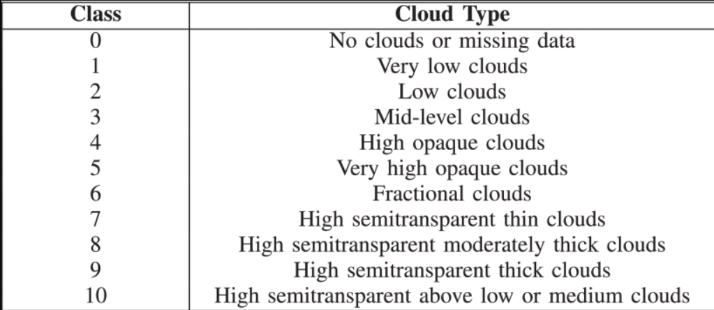
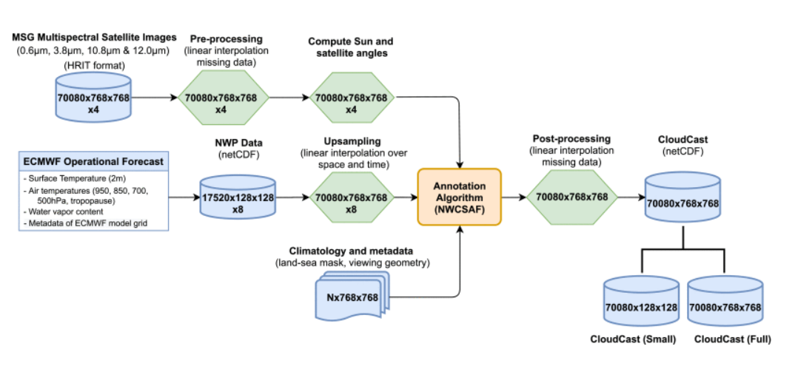
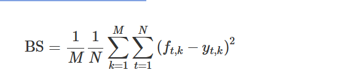
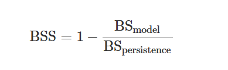

# CloudCast : 云预测模型和数据集

[CloudCast: A Satellite-Based Dataset and Baseline for Forecasting Clouds | IEEE Journals & Magazine | IEEE Xplore --- CloudCast：用于预测云的基于卫星的数据集和基线 |IEEE 期刊和杂志 |IEEE Xplore](https://ieeexplore.ieee.org/document/9366908)

> 预报云的形成和发展是现代天气预报系统的核心要素。不正确的云预报可能导致天气预报的整体准确性存在重大不确定性，因为它们在地球气候系统中起着内在的作用。**由于缺乏具有全球许多历史观测结果的高分辨率数据集，很少有研究从机器学习的角度解决这一具有挑战性的问题**。在本文中，我们提出了一个名为“CloudCast”的新型基于卫星的数据集。它由 70 080 张图像组成，具有 10 种不同的云类型，用于在像素级别上注释的多层大气。数据集的空间分辨率为 928 × 1530 像素（每像素 3 × 3 公里），帧间隔 15 分钟，时间段为 2017 年 1 月 1 日至 2018 年 12 月 31 日。所有帧都居中并投射在欧洲上空。**为了补充数据集，我们使用当前最先进的视频预测方法（例如卷积长短期记忆网络，生成对抗网络和基于光流的外推方法）进行了评估研究**。由于视频预测的评估在实践中是困难的，我们的目标是在空间和时间领域进行彻底的评估。我们的基准模型显示出有希望的结果，但有很大的改进空间。这是第一个公开可用的全球规模数据集，具有高分辨率云类型，具有高时间粒度的高分辨率云类型，据作者所知。

### 引言

云预报仍然是气象学中尚未解决的主要挑战之一，其中云误差对天气预报的整体准确性具有广泛的影响[1]，[2]。由于云的垂直和水平性质，定量测量云和评估云预报的性能**存在固有的困难**。在天气模型中，无法准确参数化并量化亚网格尺度的云、对流效应和气溶胶，这是模型估计可能带来重大不确定性的原因之一[2]

定量天气预报的主要来源来自数值天气预报（NWP）系统。对于这些数值方法，我们使用大气物理学领域的控制方程[3]来模拟未来。在过去的几十年里，由于计算能力的提高、新理论的整合和大量数据的同化，天气预报有了巨大的改进。**无论如何，这些大气模拟的计算成本仍然很高，并且在粗糙的空间尺度上运行（每像素9×9公里或以上）**[4]，[5]。此外，**目前的大气数据收集量超过每天数百PB[6]，这意味着数据收集远远超过我们分析和吸收它的能力**。因此，[4]背后的作者认为，未来我们在这个领域面临两个重大挑战：1）**从这些极端的数据中获取知识，2）开发与传统方法相比更受数据驱动的模型，同时仍然遵守物理定律**。最近的一项应用发现，气候模型对热带雨林光合作用的估计存在差异，最终导致在全球范围内对这些过程的更准确描述[7]，[8]。理想情况下，可以从数据驱动的云动力学方法中发现类似的见解，但迄今为止，在全球范围内获得足够的云观测一直是开发数据驱动的云预测方法的重大障碍。

**为了解决这个问题并激发对数据驱动的大气预报的进一步研究，我们引入了一种名为“CloudCast”的新型卫星数据集，该数据集有助于从全球视角评估云预报方法。** 当前用于全球云预测的数据集表现出粗略的空间分辨率（9×9至31×31公里）和低时间粒度（图像之间为一到多个小时）[5]，[12]-[15]。我们通过使用地球静止卫星图像克服了这两个问题，可以说是最一致和定期采样的全球云数据源[1]。由于这些卫星可以每5-15分钟获得一次图像，空间分辨率相对较高（1×1至3×3公里），因此它们为开发数据驱动的天气系统提供了基本要素，即丰富的历史观测。使用基于雷达和激光雷达的剖面方法[16]可以在垂直维度上实现更高的精度，但由于不是对地静止的，这些方法在时间分辨率上不足。我们的贡献如下。

全文的工作总结：

1. 当前用于全球云预测的数据集表现出粗略的空间分辨率（9×9至31×31公里）和低时间粒度（图像之间为一到多个小时）[5]，[12]-[15]。我们通过使用地球静止卫星图像克服了这两个问题，可以说是最一致和定期采样的全球云数据源[1]。由于这些卫星可以每5-15分钟获得一次图像，空间分辨率相对较高（1×1至3×3公里），因此它们为开发数据驱动的天气系统提供了基本要素，即丰富的历史观测。使用基于雷达和激光雷达的剖面方法[16]可以在垂直维度上实现更高的精度，但由于不是对地静止的，这些方法在时间分辨率上不足。我们的贡献如下。
2. 我们评估了四种视频预测方法，通过预测未来 4 小时作为我们数据集的基准。其中两个是基于机器学习方法的最新进展，专门用于大气预报的应用。
3. 为了评估我们的结果，我们提出了一项评估研究，用于测量卫星系统中的云预测准确性。评估设计基于世界气象组织在进行云评估研究时的最佳实践[1]，其中包括经过广泛测试的分类预报统计指标。此外，我们实现了计算机视觉文献中的峰值信噪比（PSNR）和结构相似性指数（SSIM）。这两个领域的结合应该为我们的结果提供最佳和最公平的评估。

本文的其余部分组织如下。第二节概述了相关工作。第三节介绍了新的数据集。第四节提供了测量卫星系统云预报精度的评价研究。最后，结论见第五节。

### 相关工作

我们首先简要回顾云预测文献中常用的相关数据集。在介绍相关数据集后，我们将回顾特别适合时空预测的视频预测方法。

#### A 相关数据集

我们希望向社区介绍一个特别适合开发具有全球视角的数据驱动方法的数据集。因此，我们只考虑1）地球静止卫星和2）基于模型的观测。虽然其他云数据集确实存在，具有非常高的分辨率和精度，用于局部大气分析，例如来自天空成像仪或雷达卫星的云数据集，但这些技术通常提供较差的空间覆盖范围，限制了其全球用例。

1. 基于卫星云观测

   > 在引入相关卫星数据集之前，必须区分云探测与用于气象目的（如预报）的云类型，因为两者之间的文献差异很大。
   >
   > it is essential to differentiate between cloud detection versus cloud types for meteorological purposes such as forecasting, as the literature varies considerably between the two.

   一般来说，基于卫星的云探测，通常以除云为目标，其用于气象领域，大多数方法通常处理二值云掩码, 是一个相对成熟的领域，有许多准确的方法[17]，[18]。**如前所述，我们对用于预测目的的多层云类型特别感兴趣，这极大地限制了相关文献和数据集的数量。**当我们关注多层云类型时，基于卫星的云观测可以分为原始红外亮度温度和卫星衍生的云测量。

   原始卫星亮度温度充当云顶高度的代理，该高度将在白天和晚上可用。该代理不是多层云类型的完美指标，因为云的温度也可以由其他因素（例如特定的云类型和季节性变化）来解释。

   卫星衍生的云测量通常涉及基于亮度的算法，该算法可以从多光谱图像中推断云掩模、类型和高度等变量[12]。**这是我们对新数据集采用的方法，因为它可以近乎实时地对空间和时间分辨率相对较高的多层云类型进行分类，据作者所知，只有少数相关的卫星多层云数据集存在。**对于欧洲气象卫星组织第二代（MSG）卫星，这些是EUMETSAT发布的云分析和云分析图像[14]，[15]。这些产品表现出粗略的空间分辨率（9×9 km）或不频繁的时间采样（图像之间1-3小时）[12]。由于我们直接从原始卫星图像中获取云类型，因此我们可以保持原始卫星图像的高分辨率（3×3公里）和时间粒度（15分钟采样）。虽然我们的数据集是由MSG卫星组成的，但我们的方法不仅限于任何特定的地球静止卫星系统，还可以扩展到其他星座。在欧洲以外，类似的数据集存在1）美国GOES-R卫星称为ABI云高度[21]和2）日本Himawari-8称为云顶高度产品[22]。由于它们的地理覆盖范围没有延伸到欧洲，它们不能直接与我们或欧洲气象卫星应用组织进行比较。

2. 基于模型的云观测

   > 基于模型的云是使用NWP模型的输出进行测量的，由于其覆盖全球，它是卫星观测最直接的可比替代方案。

   两种常用的全球NWP模型是欧洲ECMWF大气IFS模型[5]和美国GFS模型[13]。两者之间的分辨率各不相同，但ECMWF模型提供了最高的空间分辨率，网格间距为9×9 km[5]。由于这两种模型都是全局的，因此它们可以互换使用。使用NWP模型输出的优点是存在基于物理的未来模拟，而明显的缺点是与卫星相比，空间分辨率粗糙。其他NWP模型也存在于更精细的空间尺度上，但仅限于局部区域，通常是以国家为基础[23]，[24]。

   鉴于我们希望为数据驱动方法建立一个全局参考数据集，因此可操作的ECMWF模型被认为是最佳的基于全局模型的多层云数据集。与CloudCast相比，ECMWF数据集在空间分辨率（9×9对3×3公里）和时间分辨率（1小时对15分钟）方面较差。此外，运营中的ECMWF不是开源的，因此与机器学习和计算机视觉社区的相关性较低。

   

#### B 方法

迄今为止，在像素空间中生成准确而逼真的视频预测是一个悬而未决的问题。在不久的将来可以相对准确地进行外推帧，但是一旦未来的序列长度增加，预测像素值的固有不确定性也会增加。

已经提出了几种方法来解决这个复杂的高维任务：时空变压器网络[25]，变分自动编码器[26]，生成对抗网络（GAN）[27]-[29]和递归卷积神经网络（CNN）[30]，[31]。在视频预测文献中，任务通常由相对简单的物理学控制，例如移动MNIST数据集[32]。然而，为了预测大气流动，这项任务受到更复杂的物理学的约束。因此，我们选择的方法侧重于已明确应用于大气预报的应用，这将证明为我们的数据集选择的基准模型是合理的。它们是1）卷积长短期记忆网络（ConvLSTM）[31]，2）多级动态生成对抗网络（MD-GAN）[29]和 TV 光 L1 流（TVL1）[33]。

在视频预测文献中，任务通常由相对简单的物理学控制，例如移动MNIST数据集[32]。然而，为了预测大气流动，这项任务受到更复杂的物理学的约束。因此，我们选择的方法侧重于已明确应用于大气预报的应用，这将证明为我们的数据集选择的基准模型是合理的。它们是1）卷积长短期记忆网络（ConvLSTM）[31]，2）多级动态生成对抗网络（MD-GAN）[29]和 TV 光 L1 流（TVL1）[33]。

1. 卷积和递归神经网络 （ConvLSTM）

   ConvLSTM最初是为使用雷达图像进行降水临近预报而开发的。它被认为是使用深度学习进行大气预报的开创性论文，使其成为我们数据集的基线。虽然在ConvLSTM论文之后提出了更新的基于LSTM的视频预测方法，例如PredRNN++ [34]和Eidetic-3D LSTM [30]，但这些方法并未应用于或评估任何与大气相关的数据集，这意味着它们超出了第一节中定义的范围。

2. 基于光流的视频预测

   虽然光流是计算机视觉文献中的经典主题，但它也是气象学中全球数据同化的最重要方法之一[35]，[35]。光流已在几篇论文[33]，[36]中应用于视频预测。在[33]中，作者实现了[37]引入的光 L1 流方法，基于随后的两张原始卫星图像在空间上捕获多个尺度的 TV 云运动。估计后，将流场倒置并用于推断未来的多个步骤，以作为有效云反照率的预测。

3. 生成对抗网络

   GANs在最近的几篇论文中已被应用于视频预测[28]，[29]，[38]。其中一个[29]实现了最先进的结果，仅使用一帧作为输入即可生成具有128×128分辨率的天空中云层运动的32帧延时视频。作者使用基于两阶段生成对抗网络的方法（MD-GAN），其中第一阶段模型负责生成未来具有粗略运动的逼真照片的初始视频。然后，第二阶段模型通过在鉴别器的中间层中使用革兰矩阵强制执行运动动力学来细化初始生成的视频。

### 数据集描述

> CloudCast数据集包含70 080个云标记卫星图像，其中10种不同的云类型对应于大气的多个层，如表1所示。如第二节所述，我们采用卫星云测量方法。生成数据集的过程如下（目视检查见图 1）。
>
> 如何制作云数据集的方法概述：
>
> 从欧洲气象卫星应用组织收集70 080张原始多光谱卫星图像
>
> 针对云物理特性，为每个观测采样一个可见光通道，两个红外通道和一个水汽通道，以实现多层云检测
>
> 云分割算法标注样本。由欧洲气象卫星组织 - 支持临近预报和甚短程预报（NWCSAF）项目的卫星应用设施[39]开发的分割算法在像素级别上注释每个样本。改进分割算法：加入了气候变量和元数据，例如地理陆海掩模和观察几何形状，这些变量和元数据已证明可以显着改善中低层云检测[20]；可以还包括NWP输出，通过提供卫星数据中无法观察到的数据。即，从 ECMWF 操作模型中收集 NWP 数据，其中包括地表温度、五个不同高度（950、850、700 和 500 hPa 以及对流层顶水平）的空气温度、大气的总水蒸气含量以及 ECMWF 模型网格的元数据。虽然分割算法被认为是准确的，但也有一些限制。主要限制是低云有时被归类为中等云的情况，例如，在强热逆温的情况下，尽管使用7.3通道 μm 和太阳天顶角进行了校正。尽管如此，我们想强调的是，已经使用天载激光雷达和地面观测对分割算法进行了广泛的验证，以验证其准确性，这被认为是云层地面实况观测的最准确方法之一[20]
>
> 计算主要云类型的阈值。这些阈值主要基于照明条件、查看几何形状、地理位置和 NWP 数据。我们不会列出所有特定的阈值，因为阈值的数量在白天、夜间和黄昏之间有所不同。如果读者对这些特定值感兴趣，请参阅 [20]。
>
> 作为最后的后处理步骤，我们插入由于许多原因（例如计划中断或日照中断）而可能出现的缺失观测值。
>
> 
>
> 
>
> 

- [ ] 线性采样丢失数据。是否可以采用模型预测方式呢？技术路线：采样数据------------>场景应用--------->采样方法结果对比

### 实验

作为CloudCast数据集的初始基线研究，我们在第二节中纳入了我们综述中的几种视频预测方法。这些方法最近在类似的大气临近预报研究中取得了相当大的成功[31]，[33]。为了匹配大多数最先进的视频预测方法[41]，[42]的分辨率。我们使用立体投影裁剪和转换我们的数据集，以128×128的空间分辨率覆盖中欧。。与其他数据集的每小时观测相比，我们仍然使用15分钟间隔的完整时间分辨率，如第二节所述。

临近预报有几种不同的定义，但通常在0-2和0-6小时之间变化[43]，[44]。我们选择未来的时间范围以 15 分钟为增量（16 个时间步长）提前 4 小时，这是大多数定义的中间位置。虽然预测超过6小时在理论上是可能的，但我们预计性能会随着时间的推移而恶化，除非我们纳入仅从卫星数据中无法观察到的其他变量来解释更中长期的云动态。

我们将数据集分为 1.5 年 （75%） 的训练和 0.5 年 （25%） 的测试。理想情况下，我们希望我们的测试数据涵盖一年中的所有季节。然而，大多数班级的训练和测试之间的频率分布相对相似，如表三所示。我们还根据高度将 10 种云类型分为四种：

1) no clouds; 1）无云;
2) low clouds; 2）低云;
3) medium clouds; and 3）中等云;和
4) high clouds. 4）高云。

> 31. 施晓， 陈志， 王海， D.-Y.杨文强黄和W.-C.Woo，“卷积LSTM网络：降水临近预报的机器学习方法”，Proc. Adv. Neural Inf. Process。系统，第 802-810 页，2015 年。Convolutional LSTM network: A machine learning approach for precipitation nowcasting
> 32. I. Urbich、J. Bendix 和 R. Müller，“有效云反照率短期预测的新方法”，《遥感》，第 10 卷，第 6 期，2018 年。A novel approach for the short-term forecast of the effective cloud albedo
>
> **41.** R. Villegas, A. Pathak, H. Kannan, D. Erhan, Q. V. Le and H. Lee, "High fidelity video prediction with large stochastic recurrent neural networks", *Proc. Adv. Neural Inf. Process. Syst.*, pp. 81-91, 2019.
>
> 41. R. Villegas， A. Pathak， H. Kannan， D. Erhan， Q. V. Le 和 H. Lee， “使用大型随机递归神经网络进行高保真视频预测”， Proc. Adv. Neural Inf. Process.系统，第 81-91 页，2019 年。
> 42. **42.** X. Shi et al., "Deep learning for precipitation nowcasting: A benchmark and a new model", *Proc. Adv. Neural Inf. Process. Syst.*, 2017.
>     42. X. Shi 等人，“用于降水临近预报的深度学习：基准和新模型”，Proc. Adv. Neural Inf. Process。系统，2017 年。
> 43. **43.** Eumetcal, pp. Jan. 16, 2020, 2016, [online] Available: https://papers.nips.cc/paper/2017/hash/a6db4ed04f1621a119799fd3d7545d3d-Abstract.html.
>     43. 尤梅特卡尔，第页。2020年1月16日，2016年[在线] 可用：https://papers.nips.cc/paper/2017/hash/a6db4ed04f1621a119799fd3d7545d3d-Abstract.html。
>     44. **44.** " World Meteorological Organization. (n.d.). Nowcasting ", [online] Available: https://www.wmo.int/pages/prog/amp/pwsp/Nowcasting.htm.
>         44.“世界气象组织。（未注明日期）。临近预报“， [在线] 可用： https://www.wmo.int/pages/prog/amp/pwsp/Nowcasting.htm.

#### A基准模型

我们基于第 II-B 节中审查的方法为我们的数据集提出了一个初始基准。基线模型的结果将在第四-C节中介绍，以及所选择方法的优缺点。

如第II-B节所述，我们选择的方法侧重于已明确应用于大气预报的应用。这就是我们在 II-B 节中概述的前三个计算机视觉基准模型背后的动机。最终的基准是气象研究中通常使用并推荐作为基线的简单持久性模型[1]。由于这些模型都适用于云预测问题，因此它们应该为我们的数据集提供良好的基线。

> **1.** WMO/WWRP, "Recommended methods for evaluating cloud and related parameters" in , 2012.
>
> 1. WMO/WWRP，“评估云和相关参数的推荐方法”，2012年。

1.   Autoencoder ConvLSTM (AE-ConvLSTM)

   对于我们的第一个基线，我们实现了 [31] 中 ConvLSTM 模型的变体，其中我们引入了具有 2-D CNN 的自动编码器架构，并在最终编码表示上使用 ConvLSTM 层，而不是直接在输入帧上使用。这有助于我们 1） 在开始编码和解码时间表示之前对输入图像中的相关空间特征进行编码，以及 2） 由于 ConvLSTM 层是内存密集型的，因此训练的内存效率更高。自动编码器使用类似于UNet的跳过连接[45]。包括用于视频预测的跳过连接背后的动机是将静态像素从输入传输到输出图像，使模型专注于学习动态像素的运动[41]。

   > **31.** X. Shi, Z. Chen, H. Wang, D.-Y. Yeung, W.-K. Wong and W.-C. Woo, "Convolutional LSTM network: A machine learning approach for precipitation nowcasting", *Proc. Adv. Neural Inf. Process. Syst.*, pp. 802-810, 2015.
   >
   > 31. 施晓， 陈志， 王海， D.-Y.杨文强黄和W.-C.Woo，“卷积LSTM网络：降水临近预报的机器学习方法”，Proc. Adv. Neural Inf. Process。系统，第 802-810 页，2015 年。

   我们首先重建前 16 个输入帧，以初始化过去云移动时间序列的时空表示。为了预测未来的 16 帧，我们使用自回归方法，将预测的输出作为递归输入，以预测接下来的 16 个步骤。这与其他视频预测论文的方法类似[28]。为了在不引入对抗损失函数的情况下提高结果的清晰度，我们选择使用 ℓ1 损失。此外，我们使用批量大小 = 4 的 Adam 优化器，并实现转换器论文 [46] 中使用的优化计划，其中我们线性增加多个热身轮次的学习率，然后按比例降低它与当前步数的平方根反比。我们运行200个epoch的训练计划，初始学习率 ε=2e−4 和动量参数 β1=0.90 ， β2=0.98, 以及400个热身轮。我们注意到在 100 个 epoch 之后，我们的损失函数只略有改善。

   > **28.** A. X. Lee, R. Zhang, F. Ebert, P. Abbeel, C. Finn and S. Levine, "Stochastic adversarial video prediction", 2018.
   >
   > 28. A. X. Lee， R. Zhang， F. Ebert， P. Abbeel， C. Finn 和 S. Levine， “随机对抗视频预测”， 2018.

2. 多阶段动态生成对抗网络

   为了训练和优化MD-GAN模型，我们遵循原始作者[29]，但存在一些差异。由于MD-GAN论文侧重于视频生成而不是视频预测，因此我们对实验设计进行了必要的调整以说明这一点。我们不是将一个输入帧克隆到 16 帧并将它们馈送到生成器，而是将之前的 16 个图像馈送到生成器。

   除了这些变化之外，我们在很大程度上遵循了[29]中的方法。我们发现，将学习率固定在 0.0002 并不能产生令人满意的结果，并且经常导致生成器的模式崩溃。相反，我们采用了文章 [47] 中的技术，其中您为鉴别器 （0.0004） 设置了比生成器 （0.0001） 更高的学习率。这克服了早期模式崩溃导致训练停滞的情况，而是激励生成器欺骗鉴别器的较小步骤。

   我们发现训练过程本质上是不稳定的，这是GANs经常遇到的问题[48]。这个问题在第二阶段训练中尤其会出现，训练似乎在大约 10-20 个时期后停滞不前。

   > **29.** W. Xiong, W. Luo, L. Ma, W. Liu and J. Luo, "Learning to generate time-lapse videos using multi-stage dynamic generative adversarial networks", *Proc. IEEE Conf. Comput. Vis. Pattern Recognit.*, pp. 2364-2373, 2018.
   >
   > 29. W. Xiong， W. Luo， L. Ma， W. Liu 和 J. Luo，“学习使用多阶段动态生成对抗网络生成延时视频”，Proc. IEEE Conf. Comput。Vis. Pattern Recognit.， pp. 2364-2373， 2018.

3. TV-L光流

   我们实现了光流算法 TV - L1 类似于[33]的作者，它可以捕获多个空间尺度上的云运动，是气象目的最流行的光流算法之一[33]。光流的基本假设之一是随时间变化的恒定像素强度[33]。由于云的形成和消散，违反了这一点。因此，对流云的存在将对光流算法的准确性产生负面影响。如第 II-B2 节所述，我们可以使用预测的云图像上的估计光流递归地推断时间提前多个步骤。- TV L1 算法实际上有 11 个参数。作者[33]通过在21种不同的参数设置中找到最低的绝对偏差来优化这些参数设置，这些参数设置使用曲线下面积计算的变体作为预测时间的函数[33]。取而代之的是，我们对相对于默认值和 [33] 中找到的最佳超参数选择的 360 种不同组合的超空间进行网格搜索。由于估计流量（以及预测的像素值）将位于连续的实值空间中，因此我们将预测四舍五入到四类设置中最接近的整数。

   > **33.** I. Urbich, J. Bendix and R. Müller, "A novel approach for the short-term forecast of the effective cloud albedo", *Remote Sens.*, vol. 10, no. 6, 2018.
   >
   > 33. I. Urbich、J. Bendix 和 R. Müller，“有效云反照率短期预测的新方法”，《遥感》，第 10 卷，第 6 期，2018 年。

4. 持久性模型 

   云评估研究中推荐的基准模型之一称为持久性模型 [1]。持久性是指最近的观测结果，在本例中，是 15 分钟的滞后云标记卫星图像，复制了 16 步到未来。在有限的云运动的情况下，我们预计该模型的性能相对较好，但显然，它是幼稚的，在动态天气情况下不起作用。视频预测中最具挑战性的部分通常是真实的运动生成，因此，将其他模型与持久性模型进行比较可以显示该模型捕获和预测未来云运动动态的能力。因此，持久性模型将用作技能分数计算的基线。

#### B 指标

强调大气应用的视频预测领域的标准化评估指标很难获得。如第一节所述，我们从世界气象组织[1]中选择评估指标。由于有许多可用的指标，我们选择在参考论文中排名得分最高的指标。由于其中一些在计算机视觉和机器学习文献中很常见，因此我们只介绍非标准指标。频率偏差等指标通常称为“偏差分数”，用于衡量相对于观测事件的预测事件总数。任何高于（低于）1 的值都表示模型倾向于高估（预报不足）事件

> 1. WMO/WWRP, "Recommended methods for evaluating cloud and related parameters" in , 2012.
> 1. WMO/WWRP，“评估云和相关参数的推荐方法”，2012年。

第一个非标准指标称为“Brier Score”。在这种情况下，Brier 分数是指估计概率预测和二元结果之间的 MSE。为了将其扩展到分类多类设置，我们将相对于单热目标类变量的所有分类概率预测的单个 MSE 相加，如下所示：

其中 ft,k 是给定图像中所有类像素在时间、实际二进制结果、 N=16 未来时间 t yt,k 步长的数量和 M=4 类 k 的数量。第二个称为Brier 技能分数，它是使用给定模型相对于某些基准预测的 MSE 计算的。如第 IV-A4 节所述，我们使用持久性预测作为技能分数指标的基准。布赖尔技能分数的公式为，其中任何高于（低于）0的值都意味着所提出的模型具有优于（较差）的性能。

除了这些指标之外，我们还包括来自计算机视觉文献的视频预测指标，这些指标与气象指标一起，应该构成这种复杂环境中最公平的评估。其中包括SSIM和PSNR。

#### C. Results C. 结果

我们在图中包括测试集中通过平均精度测量的最差预测的可视化。4. 查看MD-GAN S2和AE-ConvLSTM的故障案例，我们观察到它们在云主要分散的情况下挣扎。这并不奇怪，因为这些模型倾向于生成通常聚类且适度模糊的预测。TVL1 模型预测了相当多的云移动，这是不正确的。根本原因可能是光流估计中使用的输入图像中的云消散，这将违反恒定像素强度假设。如图所示，持久性模型在具有实质性运动的情况下实现了较差的性能。

AE-ConvLSTM方法在我们的数据集上实现了最高的精度，无论是在时间和空间上测量的，还是在除中型云之外的所有云上。对于 BSS 指标，我们注意到相对于值为 0.11 的持久性模型的性能更好。这意味着将ConvLSTM层应用于云标记卫星图像确实在一定程度上捕获了时空运动。另一方面，我们在图中看到。3 随着时间的推移，预测变得越来越模糊。这与第二-B1节中的讨论是一致的。

MD-GAN 模型的性能优于持久性模型，Brier 技能得分为 0.07。分类精度没有很好地捕获，因为MD-GAN在我们的所有模型中实现了中等云的最低精度。时间精度与 ConvLSTM 模型非常匹配，尤其是对于 2 小时预测。因此，通过提高MD-GAN模型的稳定性和初始预测准确性，我们期望它成为最佳和最一致的模型。

TVL1 算法相对于 BSS 为 0.02 的持久性模型显示出略胜一筹的性能。TVL1 的接近性能和持久性背后的主要原因与 TVL1 算法的超参数选择有关，其中产生更多静态运动的超参数通常意味着随着时间的推移性能更好。我们认为，这一结果的根本原因是提前16步预测多层云的复杂性，以及违反光流假设，即随着时间的推移具有恒定的亮度强度。与AE-ConvLSTM和MD-GAN相比，它实现了较低的整体和时间精度，但对于中等云确实达到了更高的精度。虽然光流方法在大气预报中很受欢迎，如第II-B2节所述，但它们在多层云类型的应用尚未得到充分研究。因此，鉴于其卓越的性能，所提出的机器学习方法目前似乎更适合这项任务。

简单的持久性模型取得了相对较好的结果。考虑到前方 1 小时的云移动有限，高短期精度并不奇怪。然而，由于其静态性质，它在预测范围结束时达到了最低的准确性。

### 结论

我们介绍了一种名为CloudCast的新型云预测数据集，该数据集由像素标记的卫星图像和具有高时间和空间分辨率的多层云组成。该数据集有助于开发和评估垂直（高度）和水平（纬度-经度）域的大气预报和视频预测方法。基于用于视频预测的机器学习文献的最新进展以及气象学和计算机视觉文献中的传统方法，在此数据集上评估了四种不同的云临近预报模型。除了PSNR和SSIM之外，还提出了一些基于云预测研究最佳实践的评估指标。这四个模型为该数据集提供了初始基准，但显示出很大的改进空间，特别是对于接近我们预测范围末端的预测。结合机器学习和NWP的混合方法可能是在未来研究中解决中长期预测的有趣方法。

我们希望这个新颖的数据集将有助于推进和刺激新的数据驱动方法的发展，以便在一个由物理学和数值方法主导的领域进行大气预报。

